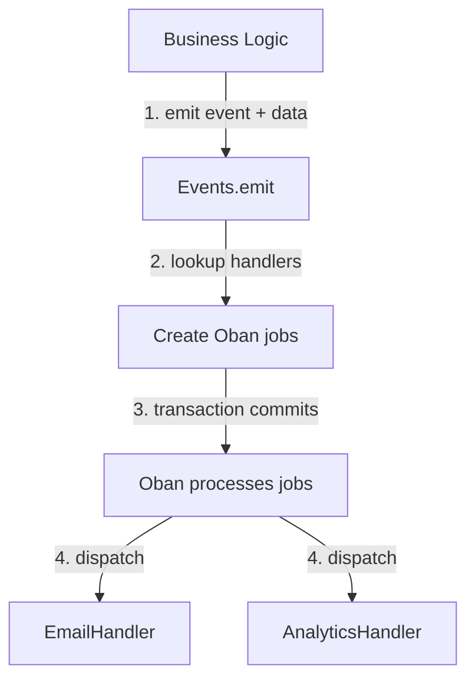

# ObanEvents

A lightweight, persistent event bus for Elixir applications built on top of [Oban](https://github.com/sorentwo/oban).

## Features

- 🔒 **Persistent** - Events survive application restarts (stored in Oban's database)
- 🔄 **Reliable** - Automatic retries on failure via Oban
- ⚡ **Async** - Non-blocking execution of handlers
- 🔗 **Transactional** - Works within database transactions for atomicity
- 📊 **Observable** - Track event processing via Oban Web UI
- ✅ **Type-safe** - Compile-time validation of events
- 🎯 **Decoupled** - Event emitters don't know about handlers

## Installation

Add `oban_events` to your list of dependencies in `mix.exs`:

```elixir
def deps do
  [
    {:oban_events, "~> 0.1.0"},
    {:oban, "~> 2.0"},
    {:postgrex, ">= 0.0.0"}  # Required by Oban
  ]
end
```

## Quick Start

### 1. Define Your Event Bus

Create a module that uses `ObanEvents` and define your events and handlers:

```elixir
defmodule MyApp.Events do
  use ObanEvents,
    oban: MyApp.Oban,
    queue: :myapp_events,
    max_attempts: 3,
    priority: 2

  @event_handlers %{
    user_created: [MyApp.EmailHandler, MyApp.AnalyticsHandler],
    user_updated: [MyApp.CacheHandler],
    order_placed: [MyApp.NotificationHandler]
  }
end
```

### 2. Create Event Handlers

Implement the `ObanEvents.Handler` behaviour. Handlers receive an `Event` struct with your data plus metadata:

```elixir
defmodule MyApp.EmailHandler do
  use ObanEvents.Handler

  require Logger

  @impl true
  def handle_event(:user_created, %Event{data: data, idempotency_key: key}) do
    %{"user_id" => user_id, "email" => email} = data

    # Use idempotency_key for outbox pattern
    case OutboxEmail.insert(%{
      idempotency_key: key,
      user_id: user_id,
      email: email,
      template: :welcome,
      status: :pending
    }, on_conflict: :nothing, conflict_target: :idempotency_key) do
      {:ok, _} ->
        Logger.info("Welcome email queued for #{email}")
        :ok

      {:error, _} ->
        Logger.info("Welcome email already queued for #{email}")
        :ok
    end
  end
end
```

### 3. Emit Events

Emit events from your application code, preferably within transactions:

```elixir
defmodule MyApp.Accounts do
  alias MyApp.{Repo, Events}

  def create_user(attrs) do
    Repo.transact(fn ->
      with {:ok, user} <- Repo.insert(changeset),
           {:ok, _jobs} <- Events.emit(:user_created, %{
             user_id: user.id,
             email: user.email
           }) do
        {:ok, user}
      end
    end)
  end
end
```

## How It Works



## Event Metadata

Handlers receive an `ObanEvents.Event` struct containing your data plus metadata for deduplication, tracing, and correlation:

```elixir
%Event{
  data: %{"user_id" => 123},                                    # Your event data
  event_id: "01933b7e-8a3f-7f6f-9e42-6c8f3a0b2d1e",           # Unique per emit
  idempotency_key: "01933b7e-9f2c-7a1b-8d4e-3c5f6a7b8c9d",    # Unique per job
  causation_id: "01933b7e-7f4a-7c2d-9b3e-4d5f6a7b8c9d",       # Optional: parent event_id
  correlation_id: "01933b7e-6e3b-7d5f-8c4e-5d6f7a8b9c0d"      # Optional: business operation grouping
}
```

### Metadata Fields

#### `event_id` - Emit Identifier
- **Generated**: Once per `emit` call (UUIDv7)
- **Shared**: All handlers for the same emit get the same `event_id`
- **Use**: Track which emit created jobs, pass as `causation_id` in child emits

```elixir
def handle_event(:user_created, %Event{event_id: id, data: data}) do
  # Emit child events, linking them to parent
  Events.emit(:send_welcome_email, data, causation_id: id)
  Events.emit(:create_user_profile, data, causation_id: id)
end
```

#### `idempotency_key` - Job Deduplication
- **Generated**: Unique per handler job (UUIDv7)
- **Use**: Outbox pattern, prevent duplicate processing on retry

```elixir
def handle_event(:send_email, %Event{idempotency_key: key, data: data}) do
  # Atomic insert - if key exists, we already processed this
  OutboxEmail.insert(%{
    idempotency_key: key,
    user_id: data["user_id"],
    status: :pending
  }, on_conflict: :nothing, conflict_target: :idempotency_key)
end
```

#### `causation_id` - Event Chains (Optional)
- **Provided**: User passes parent's `event_id` when emitting
- **Use**: Build audit trails, understand "why did this happen?"

```elixir
# Event chain:
user_registered
  event_id: "01933b7e-1111-...", causation_id: nil
  └─> send_welcome_email
        event_id: "01933b7e-2222-...", causation_id: "01933b7e-1111-..."
      └─> email_delivered
            event_id: "01933b7e-3333-...", causation_id: "01933b7e-2222-..."
```

#### `correlation_id` - Business Operation Grouping (Optional)
- **Provided**: User generates and passes to related emits
- **Use**: Group all events from a single business operation

```elixir
# User upgrades subscription - many events happen
correlation_id = UUIDv7.generate()

Events.emit(:subscription_upgraded, data, correlation_id: correlation_id)
Events.emit(:old_subscription_cancelled, data, correlation_id: correlation_id)
Events.emit(:payment_processed, data, correlation_id: correlation_id)
Events.emit(:invoice_generated, data, correlation_id: correlation_id)

# In logs: filter by correlation_id to see all related events
```

### When to Use What

| Metadata | Always Auto-Generated | User Can Override | Primary Use Case |
|----------|----------------------|-------------------|------------------|
| `data` | No | Yes (required) | Your event payload |
| `event_id` | Yes | No | Event causation tracking |
| `idempotency_key` | Yes | No | Prevent duplicate processing |
| `causation_id` | No | Yes (optional) | Build event chains |
| `correlation_id` | No | Yes (optional) | Group business operations |

## Configuration Options

When using `ObanEvents`, you can configure:

- `:oban` - Oban instance module (default: `Oban`)
- `:queue` - Oban queue name (default: `:events`)
- `:max_attempts` - Maximum retry attempts (default: `3`)
- `:priority` - Job priority, 0-3, lower is higher priority (default: `2`)

```elixir
defmodule MyApp.Events do
  use ObanEvents,
    oban: MyApp.Oban,           # Use custom Oban instance
    queue: :my_events,          # Custom queue name
    max_attempts: 5,            # Retry up to 5 times
    priority: 1                 # Higher priority than default

  @event_handlers %{
    # ...
  }
end
```

## API

Your event bus module provides these functions:

### `emit/2`

Emit an event to all registered handlers.

```elixir
@spec emit(atom(), map()) :: {:ok, [Oban.Job.t()]}

# Raises ArgumentError if event is not registered
MyApp.Events.emit(:user_created, %{user_id: 123, email: "user@example.com"})
```

### `get_handlers!/1`

Get all handlers registered for an event.

```elixir
@spec get_handlers!(atom()) :: [module()]

MyApp.Events.get_handlers!(:user_created)
# => [MyApp.EmailHandler, MyApp.AnalyticsHandler]
```

### `all_events/0`

List all registered event names.

```elixir
@spec all_events() :: [atom()]

MyApp.Events.all_events()
# => [:user_created, :user_updated, :order_placed]
```

### `registered?/1`

Check if an event is registered.

```elixir
@spec registered?(atom()) :: boolean()

MyApp.Events.registered?(:user_created)
# => true
```

## Handler Implementation

Handlers must implement the `handle_event/2` callback:

```elixir
defmodule MyApp.AnalyticsHandler do
  use ObanEvents.Handler

  @impl true
  def handle_event(:user_created, %Event{data: data}) do
    %{"user_id" => user_id} = data
    MyApp.Analytics.track("User Created", user_id: user_id)
    :ok
  end

  @impl true
  def handle_event(:user_updated, %Event{data: data}) do
    %{"user_id" => user_id, "changes" => changes} = data
    MyApp.Analytics.track("User Updated", user_id: user_id, changes: changes)
    :ok
  end
end
```

### Return Values

Handlers should return:

- `:ok` - Event processed successfully
- `{:ok, result}` - Event processed successfully with a result
- `{:error, reason}` - Event processing failed (will trigger Oban retry)

Handlers may also raise exceptions, which will trigger Oban's retry mechanism.

## Best Practices

### 1. Always Use Transactions

Emit events within transactions to ensure atomicity:

```elixir
Repo.transact(fn ->
  with {:ok, user} <- Repo.insert(changeset),
       {:ok, _jobs} <- Events.emit(:user_created, %{user_id: user.id}) do
    {:ok, user}
  end
end)
# If insert fails, emit never happens ✅
# If emit fails, transaction rolls back ✅
```

### 2. Make Handlers Idempotent

**Critical:** Handlers may be executed multiple times due to:
- Oban retries on failure
- Application restarts during processing
- Infrastructure issues (database failover, network timeouts)

Design handlers to be safe when run multiple times with the same event:

```elixir
# Example 1: Outbox pattern for external services (RECOMMENDED)
def handle_event(:send_welcome_email, %Event{
  data: data,
  idempotency_key: key,
  event_id: trace_id
}) do
  %{"user_id" => user_id, "email" => email} = data

  # Write to outbox table with idempotency_key
  # Separate worker processes the outbox
  OutboxEmail.insert(%{
    idempotency_key: key,          # Prevents duplicates on retry
    trace_id: trace_id,             # For tracing/correlation
    user_id: user_id,
    email: email,
    template: :welcome,
    status: :pending
  }, on_conflict: :nothing, conflict_target: :idempotency_key)

  :ok
end

# Example 2: Database operations - use upserts
def handle_event(:create_user_profile, %Event{data: data}) do
  %{"user_id" => user_id} = data

  %UserProfile{user_id: user_id}
  |> Repo.insert(
    on_conflict: :nothing,
    conflict_target: :user_id
  )

  :ok
end

# Example 3: Direct external API call (use event_id for tracing)
# Note: Prefer outbox pattern for critical operations
def handle_event(:track_analytics, %Event{
  data: data,
  event_id: trace_id,
  idempotency_key: key
}) do
  # Pass event_id as trace/correlation ID to external service
  AnalyticsAPI.track(
    event: "user_signup",
    properties: data,
    trace_id: trace_id,           # Links logs across systems
    idempotency_key: key          # Service can deduplicate
  )

  :ok
end

# Example 4: Multiple database changes - use Ecto.Multi
def handle_event(:subscription_upgraded, %Event{data: data}) do
  %{"user_id" => user_id, "new_plan" => new_plan, "old_plan" => old_plan} = data

  # Use Ecto.Multi for multiple related operations
  Multi.new()
  |> Multi.run(:upgrade, fn _repo, _changes ->
    Subscriptions.upgrade(user_id, new_plan)
  end)
  |> Multi.run(:credits, fn _repo, _changes ->
    Credits.add_bonus(user_id, new_plan)
  end)
  |> Multi.insert(:audit, Audit.changeset(%{
    user_id: user_id,
    old_plan: old_plan,
    new_plan: new_plan
  }))
  |> Repo.transaction()
  |> case do
    {:ok, _} -> :ok
    {:error, _failed_operation, _failed_value, _changes} ->
      {:error, :subscription_upgrade_failed}
  end
end

# Example 5: Increment operations - use atomic updates
def handle_event(:page_view, %Event{data: %{"page_id" => page_id}}) do
  # Atomic operation - naturally idempotent
  Repo.update_all(
    from(p in Page, where: p.id == ^page_id),
    inc: [view_count: 1]
  )

  :ok
end
```

### 3. Include All Necessary Data

Don't rely on database lookups for data that might change:

```elixir
# Good: Include all data needed
Events.emit(:status_changed, %{
  record_id: record.id,
  old_status: old_status,
  new_status: record.status
})

# Bad: Handler has to query DB (old_status might be wrong)
Events.emit(:status_changed, %{
  record_id: record.id
})
```

### 4. Use JSON-Serializable Data

Event data must be JSON-serializable (no PIDs, refs, or functions):

```elixir
# Good
Events.emit(:user_created, %{
  user_id: user.id,
  email: user.email,
  amount: Decimal.to_string(user.balance)
})

# Bad: Full struct is not reliably serializable
Events.emit(:user_created, %{user: user})
```

### 5. Return Errors for Retriable Failures

```elixir
def handle_event(:send_notification, %Event{data: data}) do
  case NotificationService.send(data) do
    {:ok, _} -> :ok
    {:error, :rate_limited} -> {:error, :rate_limited}  # Will retry
    {:error, :invalid_data} -> :ok  # Don't retry invalid data
  end
end
```

## Handler Management

### Renaming Handler Modules

Handler module names are serialized to the database as fully-qualified Elixir module atoms (e.g., `"Elixir.MyApp.EmailHandler"`). When you rename a handler module, existing queued jobs will still reference the old module name and will fail when Oban tries to execute them.

**Safe Renaming Strategy:**

Use a module alias to maintain backward compatibility:

```elixir
# After renaming MyApp.EmailHandler to MyApp.Notifications.EmailHandler

# 1. Create the new module with your desired name
defmodule MyApp.Notifications.EmailHandler do
  use ObanEvents.Handler

  @impl true
  def handle_event(:user_created, %Event{data: data}) do
    # Your handler logic
    :ok
  end
end

# 2. Keep the old module as an alias
defmodule MyApp.EmailHandler do
  @moduledoc false
  defdelegate handle_event(event, event_struct), to: MyApp.Notifications.EmailHandler
end

# 3. Update your event registry to use the new name
defmodule MyApp.Events do
  use ObanEvents

  @event_handlers %{
    user_created: [
      MyApp.Notifications.EmailHandler  # New jobs use new name
    ]
  }
end
```

**How This Works:**

1. **Existing queued jobs** call `MyApp.EmailHandler.handle_event/2`, which delegates to the new module
2. **New jobs** are created with `MyApp.Notifications.EmailHandler`
3. **Zero downtime** - both old and new jobs work correctly

**Cleanup:**

After all old jobs have processed (check Oban Web UI), you can safely remove the alias module. This typically takes as long as your retry window (default: a few hours with exponential backoff).

## Testing

### Testing Event Emission

```elixir
use Oban.Testing, repo: MyApp.Repo

test "emits user_created event" do
  {:ok, user} = Accounts.create_user(%{email: "test@example.com"})

  assert_enqueued(
    worker: ObanEvents.DispatchWorker,
    args: %{
      "event" => "user_created",
      "handler" => "Elixir.MyApp.EmailHandler",
      "data" => %{"user_id" => user.id}
    }
  )
end
```

### Testing Handlers

Use `ObanEvents.Testing` to easily create Event structs for testing:

```elixir
defmodule MyApp.EmailHandlerTest do
  use ExUnit.Case
  import ObanEvents.Testing

  test "sends welcome email" do
    event = build_event(%{"user_id" => 123, "email" => "test@example.com"})

    assert :ok = MyApp.EmailHandler.handle_event(:user_created, event)
    assert_email_sent(to: "test@example.com", subject: "Welcome!")
  end

  test "with custom metadata" do
    event = build_event(
      %{"user_id" => 123},
      causation_id: "parent-event-id",
      correlation_id: "test-correlation"
    )

    assert :ok = MyApp.EmailHandler.handle_event(:user_created, event)
  end
end
```

### Testing with Oban Inline Mode

For integration tests, configure Oban to execute jobs inline:

```elixir
# config/test.exs
config :my_app, Oban,
  testing: :inline,
  queues: false,
  plugins: false

# In test
test "creates user and sends email" do
  {:ok, user} = Accounts.create_user(%{email: "test@example.com"})

  # Email sent immediately in test mode
  assert_email_sent(to: "test@example.com")
end
```

## Observability

### Oban Web UI

View event processing history, errors, and retries:

```elixir
# In router.ex (development only)
import Phoenix.LiveDashboard.Router

scope "/dev" do
  pipe_through :browser
  live_dashboard "/dashboard", metrics: MyAppWeb.Telemetry

  forward "/oban", Oban.Web.Router
end
```

### Logging

ObanEvents logs all event processing:

```
[info] Processing event: user_created with handler: MyApp.EmailHandler
[info] Event processed successfully: user_created by MyApp.EmailHandler
[error] Event handler failed: user_created by MyApp.EmailHandler, error: :network_timeout
```

## Troubleshooting

### Events Not Processing

**Check Oban queue configuration:**

```elixir
# config/config.exs
config :my_app, Oban,
  repo: MyApp.Repo,
  queues: [
    events: 10  # Make sure your queue is configured
  ]
```

**Check job status in database:**

```sql
SELECT * FROM oban_jobs
WHERE queue = 'events'
ORDER BY inserted_at DESC
LIMIT 10;
```

### Events Not Emitted

**Verify event is registered:**

```elixir
iex> MyApp.Events.registered?(:user_created)
true

iex> MyApp.Events.all_events()
[:user_created, :user_updated, ...]
```

**Check transaction succeeded:**

Add logging to verify the transaction completes:

```elixir
Repo.transact(fn ->
  with {:ok, user} <- Repo.insert(changeset),
       {:ok, jobs} <- Events.emit(:user_created, data) do
    Logger.info("Emitted #{length(jobs)} jobs")
    {:ok, user}
  end
end)
```

### Handler Failures

**View errors in Oban Web UI** at `/dev/oban`

**Check application logs** for handler errors

**Manually retry failed job:**

```elixir
iex> job = Oban.Job |> Repo.get(job_id)
iex> Oban.retry_job(job)
```

## Examples

See the [test suite](test/) for complete examples of:
- Event emission
- Handler implementation
- Transaction behavior
- Testing patterns

## License

MIT License - see [LICENSE](LICENSE) for details.

## Credits

Built with [Oban](https://github.com/sorentwo/oban) by Parker Selbert.
